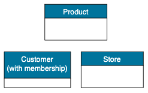
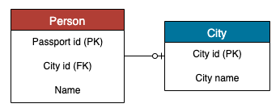
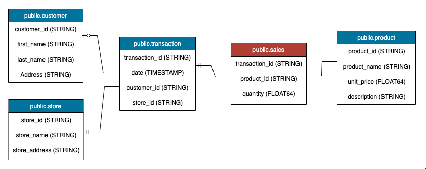

# Data Modeling

As data engineers, one of our main objectives is to drive the business forward.
However, sometimes stakeholders know what they want, but they struggle to articulate it and transfer their domain knowledge into a database design.
This is where data modeling comes in. It helps us translate business requirements into a visual representation of data and the relationships among data points.

Data can be modeled at various levels of abstraction.
The process starts by collecting requirements from business users.

> These **requirements** are then translated into a database design consisting of **entities** and **attributes**.

A good data model captures how work naturally flows within the organization.
A better data model can accommodate business changes without disrupting the foundational database design.

## Use Case

We will build a data model for a large grocery chain. The business has 100 stores spread out worldwide.
Each store has roughly 1000 individual products.
Customers may or may not use their memberships to purchase products.
The business aims to design a database system to keep track of sales and use the data to maximize profits.

## Conceptual Data Models

The data modeling process starts with high-level abstraction, namely a conceptual model.

> A conceptual data model provides a big picture of the system's contents and business rules, without going into the details of the database.

It focuses on defining entities and the relationships between them.
A typical way to visualize a conceptual model is through `Entity-Relationship (ER) diagrams`.

### Define business process

To begin the design process, the first step is to determine which business process to model.
A business process refers to a low-level activity carried out by the organization, such as taking orders, receiving payments, or processing customer requests.

> In this case, the business process is sales transactions.

### Determine key entities

Next, we will determine key entities. Each sale is linked to a few objects:

- `Store`: The store where the transaction happened.
- `Product`: The product with its unit price and description.
- `Customer`: The customer who executes the transaction with a membership.

### Relationships and Restrictions between entities

Few requirements from business:

- Each transaction is linked to a maximum of one membership account. If the customer is not a member, it won't be linked to any account.
- Each transaction contains at least one type of product.
- Each transaction is linked to one and only one store.

A conceptual data model is independent of any specific technology.
It is a great tool for creating a shared understanding of data and business requirements.
It helps stakeholders identify potential data issues and ensures that data is organized in a consistent way that supports the business.

> A **conceptual** data model serves as a foundation for creating **logical** and **physical** data models.

## Logical data models

A **logical data model** is a representation of a possible implementation of the conceptual model without being tied to any specific technology.
This stage is crucial because although the conceptual model is easier to communicate, its lack of context can make implementation challenging.

> The logical model expects more details, such as entity attributes, granularity, primary keys, foreign keys, normalization, and column descriptions.

### Entity attributes

Entity attributes describe the characteristics of an entity.
The following is an example of entity attributes:

- **Store**: `Store id`, `Store name`, `Address`
- **Customer**: `Customer id`, `Customer name`, `Customer address`
- **Product**: `Product id`, `Product name`, `Unit price`, `Description`
- **Sales**: `Transaction id`, `Product id`, `Customer id`, `Store id`, `Price`

### Primary key and foreign key

A **primary key** is a column that uniquely identifies every row in the table. A **foreign key** is a column that creates a relationship between two tables.

Normally, a primary key comes with a few constraints:

- A primary key never accepts NULL values.
- A primary key must contain unique values.
- Each table can only have one primary key, can be composite one.

In above example, the `Person` table uses `Passport id` as the primary key and `City id` as the foreign key, which is the primary key of `City` table.

> If rows cannot be uniquely identified with one primary key, it is possible to create a composite primary key. This key is composed of two or more columns and ensures the uniqueness of each row.

### Granularity

**Granularity** refers to the level of detail at which data are stored in a table.
The lower the granularity, the more details can be captured in the model.

For the `Sales` table, we have several options for its granularity, ranked from low to high:

- One row per scan of an individual product on a customer's sales transactions.
- One row per total sales of a product type on a customer's sales transactions.
- One row per total sales on a customer's sales transactions.

For this use case, the 2nd option is more approriate. The 3rd option aggregates all product sales in each transaction, but this would require remodeling the data when business users request sales data per product.

> Generally, we should aim to model our data at the lowest possible level of granularity. From there, it's easy to aggregate data to any higher grain.

Although the 1st option has the lowest grain, it may result in excessive duplicates.

> For example, a purchase of ten apples of the same kind will create 10 rows with identical information.

Defining granularity is not an easy task because the model must be flexible enough to answer various analytics questions without providing redundant information.

### Normalization

**Normalization** is another database design technique used to remove data redundancy within a relational database.
This is accomplished by decomposing a large table into smaller, logical units.

Let's see what a `Sales` table looks like without normalization.

One downside of using a denormalized table is the increased complexity of inserting, updating, and removing data.
Given that the table contains duplicated information, such as customer and store names, inserting and updating data can result in additional overhead and require more storage space.

From the use case, we can find multiple ID in the `Sales` table, such as:

- `Transaction id`: identify transaction
- `Product id`: identifier for each product
- `Customer id`: identifier for each customer
- `Store id`: identifier for each store

The idea of **normalization** is splitting the big table into smaller table, to remove duplicated information and easier, faster to retrieve the data based on analytics use cases.

> There's a risk if we split the table into smaller one, then we would need JOIN method to achieve the goals, and JOIN can cause excessive data reading and need more resources.

The **wise** decision to consider pros and cons between Normalization approach but keeping the data in a good state (faster and easy to retrieve), this is the essence of data modeling.

As the use case, we will need to normalize the table into 4 tables (`Products`, `Customers`, `Stores` and `Transactions`)

Having said that, here is the visualization of the **logical data model**.

## Physical data models

Physical data modeling is the final stage of data modeling.
It provides a database-specific representation of the logical data model, allowing engineers to visualize the structure of the database before it is built.

Some deeper topics of data modeling, such as:

- [Dimensional Modeling](dimensional-modeling/README.md)
- [DDL vs DML](ddl-vs-dml/README.md)
- [Query Life Cycle](query-lifecycle/README.md)

Reference: [Data Modeling by Educative](https://www.educative.io/courses/data-engineering-foundations/introduction-to-data-modeling)
