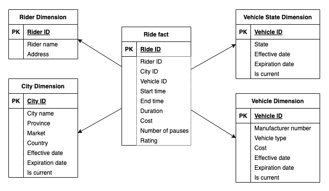

# Challenge

To illustrate the process, consider the case of an e-scooter rental company.
Users can rent a scooter from the street and ride to their destinations.
The company wants to use generated data to make strategic decisions on demand forecasting, dynamic pricing, and operational management.

## Step 1: Select the business process

Business processes are the operational activities carried out by the organization, such as buying products, registering courses, or resolving customer tickets.
First, we focus on activities that are most significant to the business.

In this example, we have several business processes in mind:

- The rider takes a ride from place A to place B.
- The rider makes a payment.
- The rider creates a customer support ticket.

For a scooter company, the first activity brings the most business value as it's the primary source of revenue.
So, we will model this activity in the next steps.

!!! warning

    Picking the right business process serves as the foundation for the entire data warehouse.

## Step 2: Declare the grain

The grain declares the level of detail in each row.
We start with atomic grain, referring to the lowest level at which data is captured in every business process.

!!! example

    every row represents one complete ride with one rider, riding from start to end.

Sometimes, rolled-up summary grain is more appropriate due to its query performance.
But such high-grain tables must be able to answer most of the business questions, otherwise, they will lead to more issues than benefits.
In the previous sales example, the business process is the sales transaction. If we choose the lowest grain where each row represents one individual product, ten apples will generate ten duplicated rows and it is not optimal.
A better solution is to roll up the same products on each transaction, which is sufficient for the business.

## Step 3: Identify the dimension

Dimensions provide "what, who, why, how, where, and when" context surrounding the business process.
Most of the dimensions are nouns such as name, address, department, and store.
In this example, we need the following dimension tables:

- **Rider**: Personal information such as rider ID, name, and address.
- **City**: Everything about the city, such as city name, province, market, and country.
- **Vehicle**: Attributes about the vehicle, such as manufacturer number, vehicle type, cost, time of birth, and status.

Next, we choose the **SCD type** for each table.

For instance, the `Rider` table adopts `SCD type 1`, given that historical rider data is irrelevant to the business.

The `City` table adopts `SCD Type 2` because the business is interested in comparing metrics before and after any attribute change in this table.

The `Vehicle` table is more complicated because attributes like `status` can change rapidly, so it falls into `SCD type 4`, and needs an extra mini-dimension table for rapidly changing attributes.

## Step 4: Identify the facts

Facts are numeric measurements derived from business processes.
Here are a few example facts for the `Ride` fact table:

- Duration of the ride
- Distance of the ride
- The total cost of the ride
- Number of pauses during the ride
- Rating of the ride

!!! warning

    While it's possible to create an extensive list of facts, it's important to collaborate with the business to only include those metrics that hold value for the company.
    Otherwise, managing "dead" metrics can become a burden during future maintenance.

