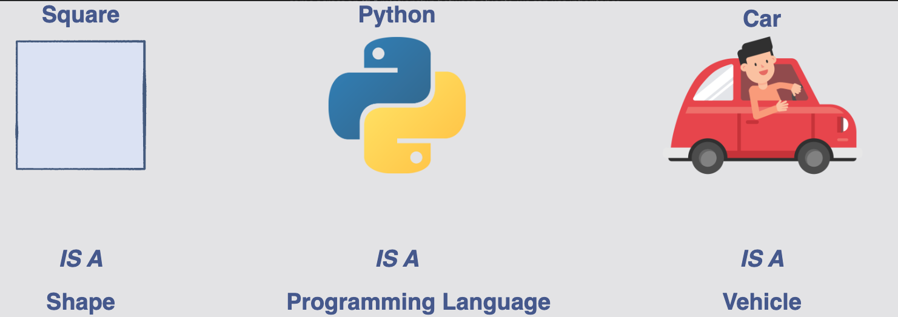

# Inheritance

## Definition

Inheritance provides a way to create a new class from an existing class.
The new class is a specialized version of the existing class such that it inherits all the non-private fields (variables) and methods of the existing class.
The existing class is used as a starting point or as a base to create the new class.

## The IS A Relationship

After reading the above definition, the next question that comes to mind is this: when do we use inheritance? Wherever we come across an IS A relationship between objects, we can use inheritance.



In the above illustration, we can see the objects have a _IS A_ relationship between them. We can write it as:

- Square _IS A_ shape
- Python _IS A_ programming language
- Car _IS A_ vehicle

## What is the `super()` function?

The use of `super()` comes into play when we implement inheritance. It is used in a child class to refer to the parent class without explicitly naming it. It makes the code more manageable, and there is no need to know the name of the parent class to access its attributes.

!!! note

    Make sure to add parenthesis at the end to avoid a compilation error.

```python
class Vehicle:  # defining the parent class
    fuelCap = 90


class Car(Vehicle):  # defining the child class
    fuelCap = 50

    def display(self):
        # accessing fuelCap from the Vehicle class using super()
        print("Fuel cap from the Vehicle Class:", super().fuelCap)

        # accessing fuelCap from the Car class using self
        print("Fuel cap from the Car Class:", self.fuelCap)


obj1 = Car()  # creating a car object
obj1.display()  # calling the Car class method display()
```

## Advantages

- Reusability: Inheritance makes the code reusable
- Less code modification, less risky
- Extensibility: Using inheritance, one can extend the base class as per the requirements of the derived class
- Important data hiding: The base class can keep some data private so that the derived class cannot alter it. This concept is called encapsulation.

## Challenge

- Follow on **Task: Handling Bank Account** and its solution

=== "Task"

    ```python
    """
        Handling Bank Account

        Task 1
            In the Account class, implement the getBalance() method that returns balance.

        Task 2
            In the Account class, implement the deposit(amount) method that adds amount to the balance. It does not return anything.

            Input
                balance = 2000
                deposit(500)
                getbalance()

            Output: 2500

        Task 3
            In the Account class, implement the withdrawal(amount) method that subtracts the amount from the balance. It does not return anything.

            Input
                balance = 2000
                withdrawal(500)
                getbalance()

            Output: 1500

        Task 4
            In the SavingsAccount class, implement an interestAmount() method that returns the interest amount of the current balance. Below is the formula for calculating the interest amount:
            interest_amount = (interest_rate * balance) / 100

            Input
                balance = 2000
                interestRate = 5
                interestAmount()

            Output: 100
    """

    class Account:
        def __init__(self, title=None, balance=0):
            self.title = title
            self.balance = balance

        def withdrawal(self, amount):
            # write code here
            pass

        def deposit(self, amount):
            # write code here
            pass

        def getBalance(self):
            # write code here
            pass


    class SavingsAccount(Account):
        def __init__(self, title=None, balance=0, interestRate=0):
            super().__init__(title, balance)
            self.interestRate = interestRate

        def interestAmount(self):
            # write code here
            pass


    # code to test - do not edit this
    demo1 = SavingsAccount("Mark", 2000, 5)  # initializing a SavingsAccount object
    ```

=== "Solution"

    ```python
    class Account:  # parent class
        def __init__(self, title=None, balance=0):
            self.title = title
            self.balance = balance

        # withdrawal method subtracts the amount from the balance
        def withdrawal(self, amount):
            self.balance = self.balance - amount

        # deposit method adds the amount to the balance
        def deposit(self, amount):
            self.balance = self.balance + amount

        # this method just returns the value of balance
        def getBalance(self):
            return self.balance


    class SavingsAccount(Account):
        def __init__(self, title=None, balance=0, interestRate=0):
            super().__init__(title, balance)
            self.interestRate = interestRate

        # computes interest amount using the interest rate
        def interestAmount(self):
            return (self.balance * self.interestRate / 100)


    obj1 = SavingsAccount("Steve", 5000, 10)
    print("Initial Balance:", obj1.getBalance())
    obj1.withdrawal(1000)
    print("Balance after withdrawal:", obj1.getBalance())
    obj1.deposit(500)
    print("Balance after deposit:", obj1.getBalance())
    print("Interest on current balance:", obj1.interestAmount())
    ```
