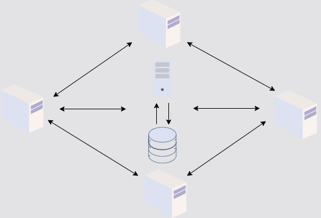
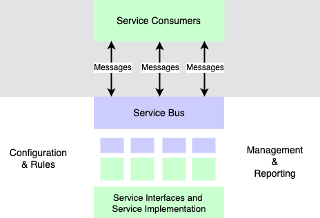

# Scaling Python

We are all aware that processors are not becoming fast at a rate where a single threaded application could, one day, be fast enough to handle any size workload.
That means we need to think about using more than just one processor.
Building scalable applications implies that you distribute the workload across multiple workers using multiple processing units.

## Types of applications

- **Single-threaded application**

  This should be your first pick, and indeed it implies no distribution.

- **Multi-threaded application**

  Most computers, even your smartphone, are now equipped with multiple processing units.
  If an application can overload an entire CPU, it needs to spread its workload over other processors by spawning new threads (or new processes).

- **Network distributed application**

  This is your last resort when your application needs to scale significantly,
  and not even one big computer with plenty of CPUs is enough.
  These are the most complicated applications to write because they involve a network.

## Multithreading

Scaling across processors is usually done using multithreading.
Multithreading is the ability to run code in parallel using threads.
Since they run in parallel, that means they can be executed on separate processors even if they are contained in a single process.

Therefore, when writing a multithreaded application, the code always runs concurrently but runs in parallel only if there is more than one CPU available.

### Drawbacks

If you have been in the Python world for a long time, you have probably encountered the word `GIL`, and know how hated it is.
The GIL is the Python `Global Interpreter Lock`, a lock that must be acquired each time CPython needs to execute byte-code.
Unfortunately, this means that if you try to scale your application by making it run multiple threads, this global lock always limits the performance of your code.

The reason that the GIL is required in the first place is that it makes sure that some basic Python objects are thread-safe.
For example, the code in the following example would not be thread-safe without global Python lock

```python
import threading

x = []

def append_two(l):
  l.append(2)

threading.Thread(target=append_two, args=(x,)).start()
x.append(1)
print(x)
```

That code prints either `[2,1]` or `[1,2]` no matter what,
while there's no way to know which thread appends 1 or 2 before the other.
This will be difficult to achieve Idempotency.

## Distributed Systems

When an application uses all the CPU power of a node, and you can't add more processors to your server or switch to a bigger server, you need a plan B.
The next step usually involves multiple servers, linked together via a network of some sort.



- `Horizontal scalability`

the ability to add more nodes as more traffic comes in.

- `Fault tolerance`

If a node goes down, another one can pick up the traffic of the dysfunctioning one.

All of this means that an application which is going the distributed route expands its complexity while potentially increasing its throughput.
Making this kind of architecture decision requires great wisdom.

## Service-Oriented Architecture

If you've never heard of it, service-oriented architecture is an architectural style where a software design is made up of several independent components communicating over a network.
Each service is a discrete unit of functionality that can work autonomously.



### Statelessness

Service built for this kind of architecture should follow a few principles among them being **stateless**.
That means services must either modify and return the requested value (or an error) while separating their functioning from the state of data.
This is an essential property, as it makes it easier to scale the services horizontally.

### Caveats of splitting

Having too many services has a cost, as they come with some overhead.
Think of all of the costs associated, such as maintenance and deployment, not only development time.
Splitting an application should always be a well-thought out decision.

## Several Effort to scaling Python in its code

- [CPU Scaling](cpu-scaling)
- [Asynchronous Events](async-solution)
- [Queue-Based Distribution](queue-distribution)

Reference: [The Hacker's Guide to Scaling Python by Educative](https://www.educative.io/courses/hackers-guide-scaling-python)
